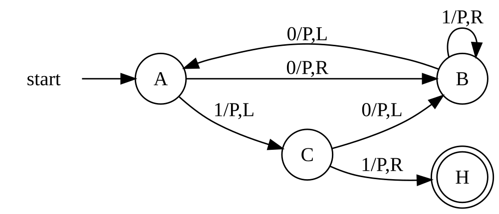
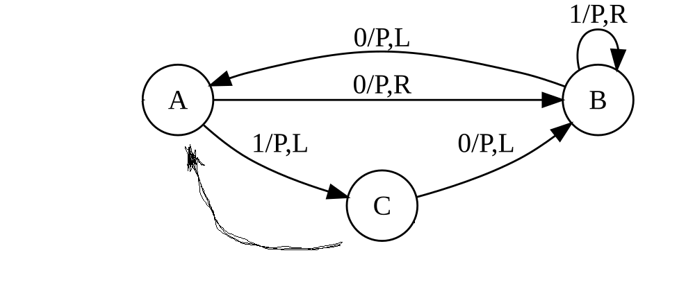

# Description 
The halt problem asserts that we cannot prove that the program stops or run forever. That's why we do it simultaneously. But as a result, the points will be in superposition in meaning that's any of each can be halt point or start loop point.

We need three conditions to be satisfied simultaneously:
1. Transition from start transition point to next point(end point) has not yet happened (ORDER MATTER A -> B != B -> A)
2. Start transition point passed EXACTLY TWICE
3. End transition point passed ONLY ONCE.

        if number_of_occurrences[&prev] == 2 
        && number_of_occurrences[&next] == 1
        && transition[&prev].contains(&next) {
            super_position_one = Some(prev);
            super_position_two = Some(next);
            break;
        }

# Proof
axiom 
We can imagine any Turing machine as a Turing machine by observing a certain node if it is touched at least twice as stopping.
1. If there is a cycle in a Turing machine, then there is a single transition in it (ORDER MATTER A -> B != B -> A)
2. If you number the points, then after such a pass, then at the point where the cycle leads the vertex will have ONE. (we mark each node as we walk through it)
3. Then there is always a loop in which the previous point has the value TWO, the next one is ONE and, moreover, that loop only one and infinity.
4. After passing, the second node will take the value TWO, so we can imaginete it like second halt Turing machine.

# Example Busy beaver(3)

Default formulation of the problem 

To resolve it superposition, i assume that program run infinity from point "A". 

Updated formulation of the problem

So i say tha's start point of the loop is "A". 
End the halt point is "C".

# Unraveling Superpositions
In real code, instruction have semantic also, if we found the minimum. My hypothesis is that there is a method to come up with to see them all in order by time. Provided that we know at least one most upperest halt point or run loop point (for usual programm it is just main function's that's we expect halt), then we resolve all points in the superpositions.

# Hypothesises
1. So where "halt point"? Halt point every where (depends of watcher), and start of loop after placed after it.
2. I find the halt point and the start point of the loop at the same time, in fact I find two equivalent programs at once, one that halt and the other run infinity.
3. After resolving all superpositions, code that is not reachable (traversed zero times) is completely unreachable

# Special thanks my friends
Vyacheslav Goma, Hirrolot, Dmitry Ylin
